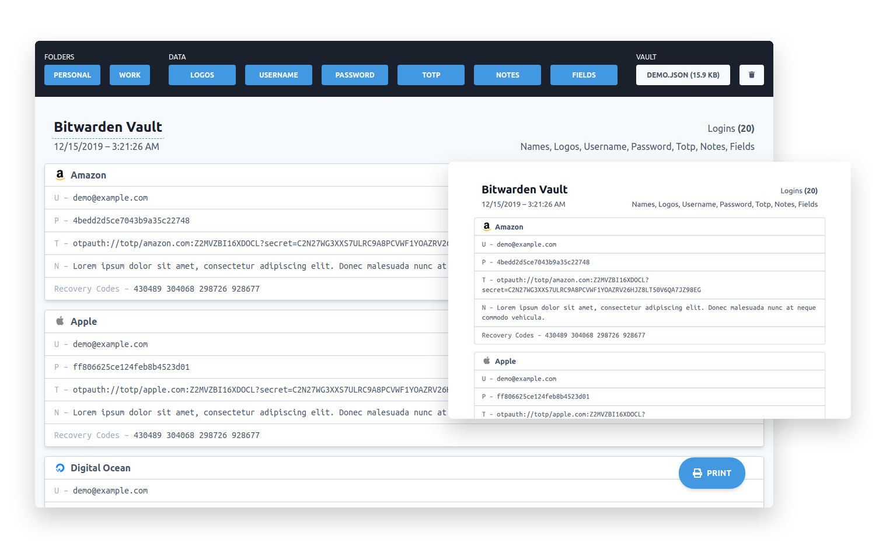

# BitPrint

**BitPrint** turns an [exported Bitwarden vault](https://help.bitwarden.com/article/export-your-data/) into a layout which is designed to be printed. Processing is handled client side.

I would not recommend using this for personal use. I made this for myself, more as of a proof of concept rather than something meant to be shared. Always be cautious when dealing with your exported vault.

**TL;DR: Do not import your personal vault on my site. Use the [demo](https://bitprint.kmr.io/?demo), your own fake data, or fork the repo and run it yourself.**



## Demo

- [bitprint.kmr.io/?demo](https://bitprint.kmr.io/?demo) (start here)
- [bitprint.kmr.io/demo.json](https://bitprint.kmr.io/demo.json) (vault export)
- [bitprint.kmr.io/demo.pdf](https://bitprint.kmr.io/demo.pdf) (pdf to print)

## Requirements

- Node 10.x
- Yarn 1.x

## Quick Start

```
$ yarn setup
$ yarn start
```

Navigate to http://localhost:3000.

## Development

**Features**

- React 16, Express 4, and Tailwind CSS
- Prettier with Husky enabled on pre-commits

**Setup Project**

- Installs dependencies for the **Client**.
- Creates an .env file with defaults if one doesn't exist.

```
$ yarn setup
```

**Start development server**

- **Client:** http://localhost:3000

```
$ yarn start
```

## Environment Variables

Located in the [.env](.env) file. Follow [.env.example](.env.example) as an example.

## Production

**Setup Project**

```
$ yarn setup
```

**Build Client**

```
$ yarn build
```

**Serve Client**

```
$ yarn serve
```

## How do I get my vault export?

[help.bitwarden.com/article/export-your-data/](https://help.bitwarden.com/article/export-your-data/)
